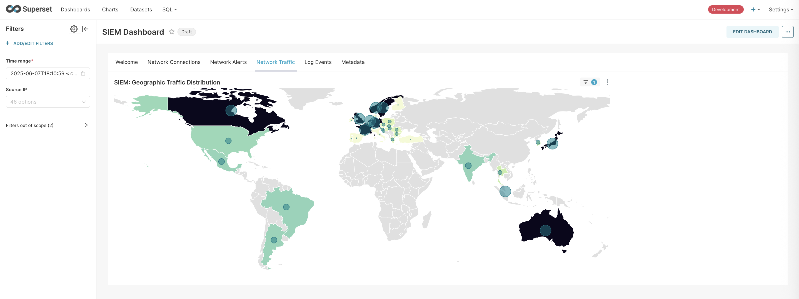
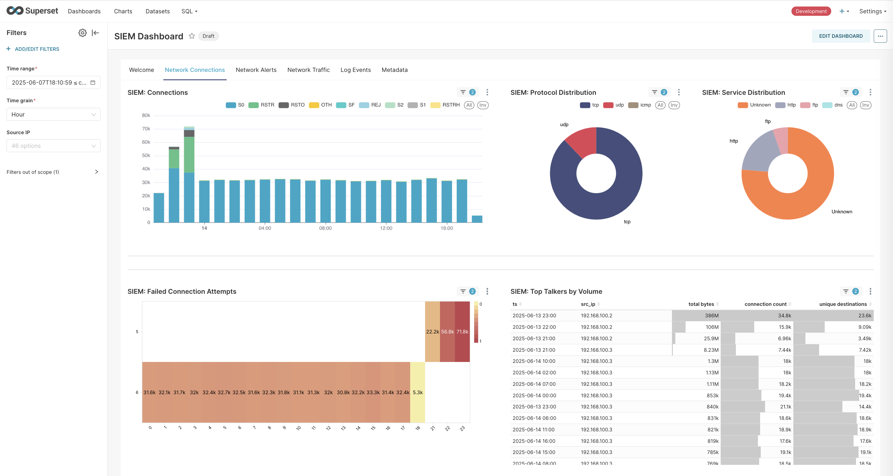
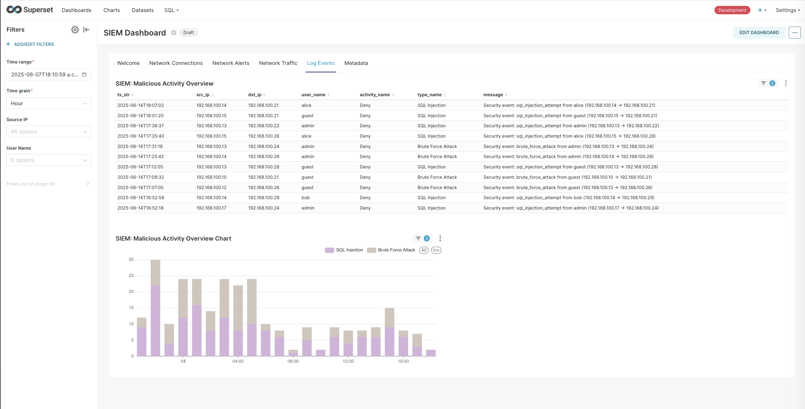
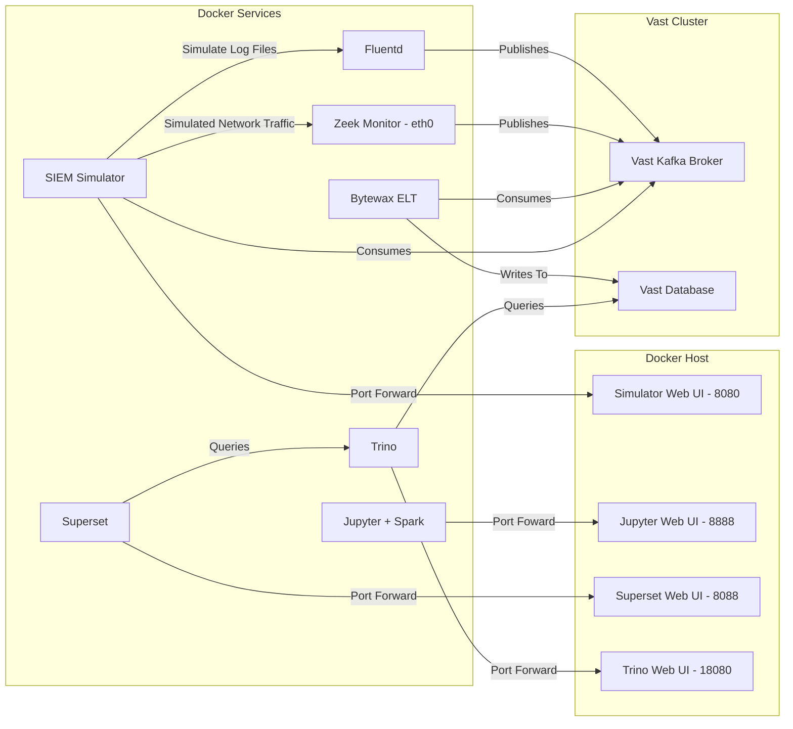

# SIEM Demo

## Overview

This application provides a streamlined environment for generating SIEM events and network traffic using Zeek and Fluentd, open-source network tools. It leverages Docker and standard bridge networking to simplify deployment and management.

This application is usually deployed alongside traditional SIEM solutions like Splunk.

> [!NOTE]
> This demo currently showcases how the system works under normal conditions rather than testing its performance limits and ability to scale, which will be the focus of later work.

## Screenshots

### Traffic Distribution


More screenshots ...

<details>
<summary>Network Connections</summary>
    

</details>

<details>
<summary>Log Events</summary>
    

</details>


## Architecture

The application consists of Docker Compose services.



-   **SIEM-simulator**: A Python-based container using Scapy and other tools to generate various types of network traffic and SIEM events. It includes a web interface for easy control.
-   **zeek-live**: The core Zeek monitoring container. It captures traffic on its `eth0` interface within the `zeek-network` (including traffic from the Traffic Simulator) and sends analyzed logs to the Kafka Broker.
-   **fluentd**: A log collection and forwarding service that reads log events from the traffic simulator and forwards them to Kafka in JSON format with structured parsing.
-   **Bytewax ETL**: Provides two stream processors that consumer the zeek and fluentd events from Vast Kafka and persist them to Vast Database.
-   **trino**: A distributed SQL query engine that provides the primary interface for analyzing data stored in the Vast Database. Includes a web UI for query execution and management.
-   **superset**: An Apache Superset web application for data visualization and dashboard creation, with pre-configured connections to Trino for exploring SIEM analytics data.
-   **jupyspark**: A Jupyter Notebook environment with Apache Spark pre-installed for data analysis and processing.

## Setup

To get the application up and running, follow these steps:

1.  **Prerequisites**:
    - Ensure you have Docker and Docker Compose (v2.2+) installed. Official docker preferred over distribution provided docker.
    - Ports free on docker host: 8080, 8088, 8888, 18080

3.  **Clone the repository**: If you haven't already, clone the repository containing the project files.
4.  Create a `.env` file in the project root directory and configure the environment variables. See [.env-example](./.env-example)
5.  **Build and start the services**: Navigate to the project directory in your terminal and run:
    ```bash
    docker compose --profile all up --build -d
    ```
    The `-d` flag runs the services in detached mode.
    Docker Compose will automatically load the environment variables from the `.env` file.
6.  **Verify services are running**:
    ```bash
    docker compose --profile all ps
    ```
    You should see the docker services with `State` as `Up`.

> [!TIP]
> Docker profiles have been configured to allow you to selectively run services if required:
>  - `all`: run everything
>  - `simulator`: run the SIEM simulator, zeek-live-monitor and fluentd services
>  - `etl`: run the jupyspark service (notebooks need to be manually started)
>  - `dashboard`: run the trino and superset service


6. **Run the data Simulator**: `./bin/start_simulator.sh`
7. **Import the Superset Dashboard**: `./bin/import_superset_dashboard.sh`
8. **Login to Superset**: http://your-docker-compose-host:8088 admin/admin
9. **Wait for tables**: Some dashboard charts will display as broken until enough data has been created to result in creation of the Vast Database tables.

> [!TIP]
> You can change the parameters of the data generation at http://your-docker-compose-host:8080.
