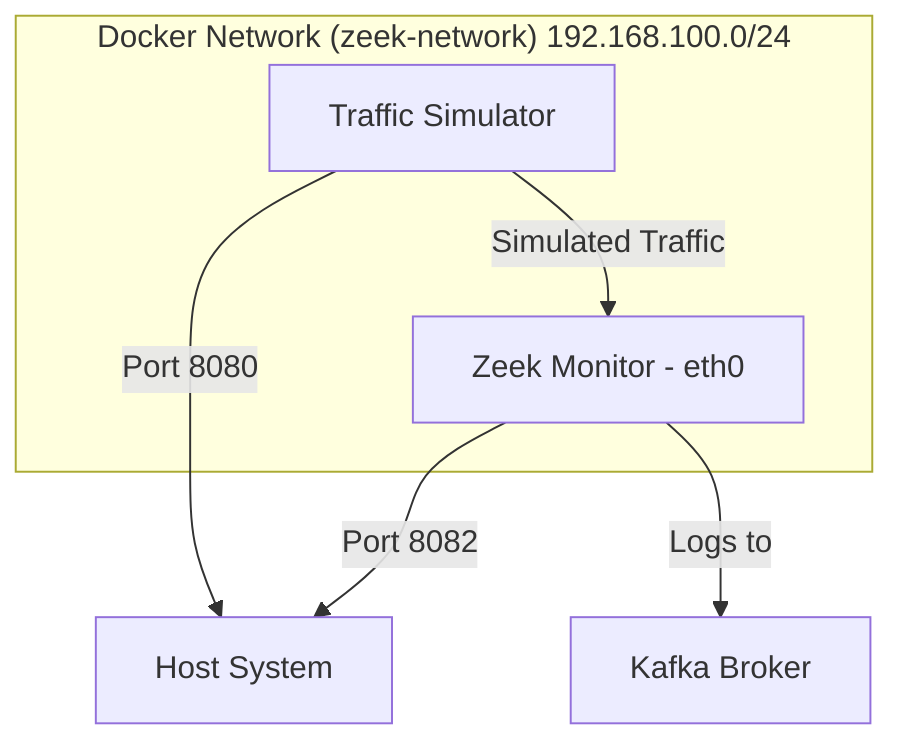

# Zeek Network Monitoring Service Documentation

This document provides detailed documentation for the simplified Docker-based Zeek network monitoring setup.

## 1. Overview

This application provides a streamlined environment for monitoring network traffic using Zeek, an open-source network analysis framework. It leverages Docker and standard bridge networking to simplify deployment and management compared to more complex virtual network setups. The system includes a Zeek monitoring container and a traffic simulation container to generate test traffic.

## 2. Architecture

The application consists of two main Docker services connected via a standard Docker bridge network (`zeek-network`). Zeek monitors the traffic flowing between containers on this network and outputs logs to a Kafka broker.



-   **zeek-live**: The core Zeek monitoring container. It captures traffic on its `eth0` interface within the `zeek-network` (including traffic from the Traffic Simulator) and sends analyzed logs to the Kafka Broker.
-   **traffic-simulator**: A Python-based container using Scapy to generate various types of network traffic. It includes a web interface for easy control.

## 3. Setup

To get the application up and running, follow these steps:

1.  **Clone the repository**: If you haven't already, clone the repository containing the project files.
2.  **Build and start the services**: Navigate to the project directory in your terminal and run:
    ```bash
    docker compose up --build -d
    ```
    The `-d` flag runs the services in detached mode.
3.  **Verify services are running**:
    ```bash
    docker compose ps
    ```
    You should see `zeek-live-monitor` and `scapy-traffic-sim` listed with `State` as `Up`.

## 4. Components

### 4.1. `zeek-live` Service

The service is defined in `docker-compose.yml`.  You only need to configure the `KAFKA_BROKER` and `KAFKA_TOPIC` environment variables.

-   **Purpose**: Monitors network traffic within the `zeek-network`.
-   **Dockerfile**: `Dockerfile` - Builds the Zeek image, installs the Zeek-Kafka plugin, and copies the monitoring script.
-   **Configuration**:
    -   **Environment Variables**:
        -   `KAFKA_BROKER`: Kafka broker address. Used by the Zeek-Kafka plugin. This variable must be set for Zeek to connect to Kafka.
        -   `KAFKA_TOPIC`: Kafka topic name for logs (default: `zeek-live-logs`).
        -   `MONITOR_INTERFACE`: Network interface for Zeek to monitor (default: `eth0`). In this simplified setup, `eth0` is the container's interface on the Docker bridge network.
    -   **Volumes**:
        -   `./zeek-config:/config`: Mounts the local `zeek-config` directory containing Zeek scripts (like `kafka-live.zeek`) into the container's `/config` directory.
        -   `./zeek-logs:/logs`: Mounts the local `zeek-logs` directory to store Zeek's output logs persistently.
        -   `./scripts:/scripts`: Mounts the local `scripts` directory containing the `monitor-live.sh` script.
    -   **Networks**: Connected to the `zeek-network` bridge network.
    -   **Capabilities**: `NET_ADMIN`, `NET_RAW` - Required for packet capture.
    -   **Privileged**: `true` - Enables promiscuous mode for the network interface, necessary for capturing all traffic.
    -   **Ports**: `8082:80` - Proxies host port 8082 to container port 80. This port is not actively used by the current services but is kept for potential future use or compatibility.
    -   **Command**: `/scripts/monitor-live.sh` - Executes the monitoring script on container startup.

### 4.2. `traffic-simulator` Service

-   **Purpose**: Generates various types of network traffic for testing Zeek's monitoring capabilities.
-   **Dockerfile**: `Dockerfile.scapy` - Builds a Python environment with Scapy and other network tools.
-   **Configuration**:
    -   **Volumes**: `./traffic-scripts:/traffic-scripts`: Mounts the local `traffic-scripts` directory containing the Python traffic generation scripts.
    -   **Ports**: `8080:8080` - Maps host port 8080 to container port 8080, exposing the web interface for the traffic generator.
    -   **Networks**: Connected to the `zeek-network` bridge network.
    -   **Capabilities**: `NET_ADMIN`, `NET_RAW` - Required for crafting and sending raw packets using Scapy.
    -   **Command**: `python3 /traffic-scripts/traffic_server.py` - Starts the web server for the traffic generator.

### 4.3. `zeek-network`

-   **Purpose**: A Docker bridge network connecting the two services. This is the network segment that Zeek monitors.
-   **Configuration**:
    -   **Driver**: `bridge` - Standard Docker bridge network.
    -   **IPAM**: Configured with a static subnet `192.168.100.0/24`.

## 5. Zeek Configuration (`zeek-config/kafka-live.zeek`)

This Zeek script configures Zeek for live monitoring and sending logs to Kafka, along with loading various protocol analyzers and detection policies. The Kafka broker address *must* be specified using the `KAFKA_BROKER` environment variable. If this variable is not set, Zeek will exit with an error.

-   **Protocol Analyzers Loaded**: `conn`, `dns`, `http`, `ssl`, `ftp`, `ssh`, `smtp`. These enable Zeek to parse and log events for these specific protocols.
-   **Detection Frameworks/Policies Loaded**: Includes policies for notice generation, known hosts/services, external DNS names, FTP/HTTP/SSH detection (including SQL injection and brute-forcing), SSL certificate validation, JSON logs, traceroute detection, and software vulnerability/version changes.
-   **Kafka Plugin**: `@load Seiso/Kafka` loads the installed Kafka plugin.
-   **Logging Configuration**:
    -   `Log::enable_local_logging = T`: Enables writing logs to local files in addition to Kafka.
    -   `Log::default_rotation_interval = 1hr`: Rotates log files hourly.
    -   `Log::default_logdir = "/logs"`: Sets the output directory for local logs (mounted from `./zeek-logs`).
-   **Kafka Configuration (`Kafka::kafka_conf`)**:
    -   `metadata.broker.list`: Specifies the Kafka broker address.
    -   `client.id`: Client identifier for Kafka (default: `zeek-live-monitor`).
    -   `batch.num.messages = 1`, `queue.buffering.max.ms = 10`, `linger.ms = 0`: Settings optimized for low-latency delivery to Kafka, sending messages almost immediately.
    -   `acks = 1`: Requires acknowledgment from the Kafka leader broker.
    -   `retries = 3`, `delivery.timeout.ms = 5000`, `request.timeout.ms = 2000`, `socket.timeout.ms = 1000`: Retry and timeout settings for Kafka communication.
    -   `debug = "broker,topic,msg"`, `log_level = 7`: Enable verbose Kafka debugging logs within Zeek.
-   **Kafka Log Sending**: `Kafka::send_all_active_logs = T` sends all generated logs (connection, http, dns, etc.) to Kafka.
-   **Timestamp Format**: `Kafka::json_timestamps = JSON::TS_ISO8601` uses ISO8601 format for timestamps in JSON logs sent to Kafka.
-   **JSON Output**: `LogAscii::use_json = T` configures local logs to also use JSON format.
-   **Checksum Offloading Fix**: `ignore_checksums = T` is set to ignore invalid TCP checksums, which are common in containerized environments due to NIC offloading.
-   **Detection Thresholds**: `SSH::password_guesses_limit = 3` makes the SSH brute force detection more sensitive for demonstration purposes.
-   **Event Handlers**: Includes custom `zeek_init`, `connection_established`, `new_connection`, `dns_request`, `http_request`, `http_reply`, `notice`, `SSH::password_guesses_exceeded`, `new_packet`, `connection_state_remove`, and `weird` event handlers with `print` statements for basic console output within the Zeek container logs. The `dns_request` and `http_request` handlers include simple pattern matching for suspicious activity that triggers Zeek notices.

## 6. Traffic Generation

Traffic within the `zeek-network` is automatically monitored by the `zeek-live` container. You can generate test traffic in several ways:

1.  **Web Interface (Traffic Simulator)**:
    -   Access the traffic simulator web interface at `http://localhost:8080`.
    -   This interface provides buttons to start various predefined scenarios (Web Browsing, File Transfer, Video Stream, Office Network, Security Test, Enhanced Attacks, Port Scan, SQL Injection) and a form for custom traffic generation (HTTP, DNS, Mixed).
    -   It also includes controls for a continuous simulation mode that runs random scenarios with configurable intervals and concurrency.
    -   A Kafka Consumer section allows viewing logs received from Zeek via Kafka directly in the browser.
    -   The web interface uses the `traffic-scripts/traffic_server.py` Flask application.

2.  **Traffic Simulator Scripts**:
    -   The `traffic-scripts/network_traffic_generator.py` and `traffic-scripts/enhanced_traffic_generator.py` Python scripts contain the logic for generating various types of traffic using Scapy and real socket connections.
    -   `network_traffic_generator.py` focuses on generating packets at the network layer (using `sendp` or `send`), simulating various scenarios like web browsing, file transfer, etc.
    -   `enhanced_traffic_generator.py` focuses on creating *real* network connections using Python's `socket` and `requests` libraries (if available). This is crucial for generating traffic that Zeek can fully analyze, such as complete HTTP requests or TCP handshakes. It includes functions for generating real HTTP, malicious HTTP, DNS, port scan, SSH brute force, and data exfiltration traffic, as well as a comprehensive attack simulation.
    -   These scripts are executed by the `traffic-simulator` container.

3.  **Container-to-Container Communication**:
    -   Any communication initiated directly between containers on the `zeek-network` (e.g., `docker exec traffic-simulator ping zeek-live-monitor`) will also be monitored by Zeek.

## 7. Monitoring and Logging

Zeek captures and analyzes traffic on its `eth0` interface within the `zeek-network`. Logs are generated and outputted to Kafka, and also saved to local files.

Logs are available in two primary locations:

1.  **Kafka**:
    -   The Zeek-Kafka plugin sends all active logs to the configured Kafka broker and topic (`172.200.204.1:9092`, `zeek-live-logs`) by default.
    -   Logs sent to Kafka are in JSON format with ISO8601 timestamps and tagged.
    -   You can view these logs using a Kafka consumer or via the Kafka Consumer section in the traffic simulator web interface (`http://localhost:8080`).

2.  **Local Log Files**:
    -   Zeek writes logs to the `/logs` directory inside the container, which is mounted to the local `./zeek-logs` directory.
    -   Logs are in JSON format (`conn.log`, `http.log`, `dns.log`, etc.).
    -   You can view these logs directly on your host machine in the `./zeek-logs` directory.
    -   Example: `cat zeek-logs/conn.log`

3.  **Container Logs**:
    -   Basic event messages printed by the `monitor-live.sh` script and the custom Zeek event handlers in `kafka-live.zeek` are sent to the container's standard output.
    -   You can view these using `docker compose logs -f zeek-live`.

## 8. Troubleshooting

### Common Issues

-   **Interface not found**: Zeek might fail to start if the specified `MONITOR_INTERFACE` (`eth0`) is not available.
    -   Check available interfaces inside the container: `docker exec zeek-live-monitor ip link show`
-   **No traffic captured**:
    -   Ensure containers are in the same `zeek-network`.
    -   Verify traffic is being generated (check traffic simulator logs).
    -   Confirm Zeek is monitoring the correct interface (`eth0`).
-   **Kafka connection issues**:
    -   Check the `KAFKA_BROKER` address in `docker-compose.yml` and `zeek-config/kafka-live.zeek`.
    -   Verify the Kafka broker is running and accessible from the Zeek container.
    -   Zeek is configured to retry Kafka connections and will continue monitoring even if Kafka is unreachable. Check the Zeek container logs for Kafka-related debug messages.

### Debug Commands

-   **Check network configuration**:
    ```bash
    docker network ls
    docker network inspect zeek-service_zeek-network
    ```
-   **Check container networking**:
    ```bash
    docker exec zeek-live-monitor ip addr show
    docker exec zeek-live-monitor ip route show
    ```
-   **Test connectivity between containers**:
    ```bash
    docker exec traffic-simulator ping zeek-live-monitor
    ```
-   **View Zeek container logs**:
    ```bash
    docker compose logs -f zeek-live
    ```
-   **View Traffic Simulator container logs**:
    ```bash
    docker compose logs -f traffic-simulator
    ```

## 9. Migration from Complex Setup

This simplified setup offers several benefits over previous versions that might have used complex virtual networking scripts:

-   ✅ Easier to understand and maintain
-   ✅ Standard Docker networking
-   ✅ No complex virtual network scripts
-   ✅ Faster startup time
-   ✅ Better container isolation
-   ✅ Easier debugging and troubleshooting
-   ✅ More portable across different environments

If migrating, remember to back up existing logs and update your `docker-compose.yml` to use this simplified version.

## 10. Additional Resources

-   [Zeek Documentation](https://docs.zeek.org/)
-   [Zeek-Kafka Plugin](https://github.com/SeisoLLC/zeek-kafka)
-   [Docker Networking](https://docs.docker.com/)
-   [Scapy Documentation](https://scapy.net/)
