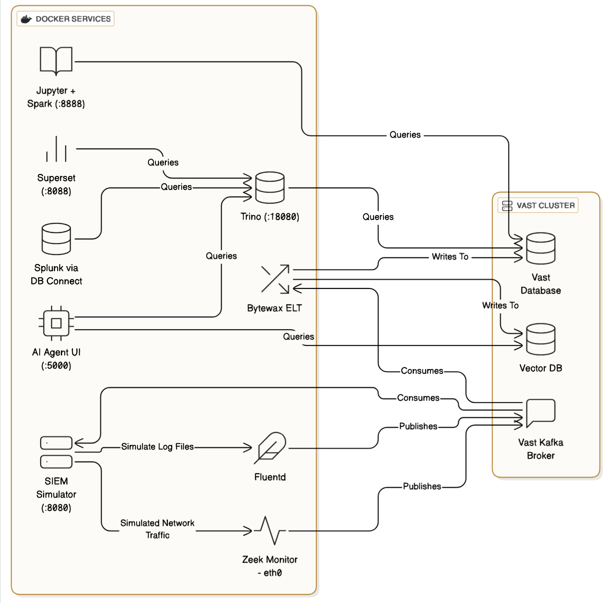

# SIEM Demo

## Overview

This application provides a streamlined environment for generating SIEM events and network traffic using Zeek and Fluentd, open-source network tools. It leverages Docker and standard bridge networking to simplify deployment and management.

This application is usually deployed alongside traditional SIEM solutions like Splunk.

## Why VAST?

Vast Data's offerings significantly enhance SIEM capabilities by providing a high-performance, scalable, and AI-ready platform. Vast Database excels in rapid analytics on structured security data, facilitating quick lookups, accelerated investigations, and efficient long-term storage of petabyte-scale log volumes. Vast Kafka delivers real-time, high-throughput data ingestion directly into Vast Database, streamlining the data pipeline and reducing latency for threat detection.

Looking forward, the Vast Vector Store, set for improvements by December 2025, will enable advanced AI-driven security analytics, including anomaly detection and semantic searches for malware, by storing and querying vector embeddings at petabyte scale. Integration with NVIDIA NIMs (NVIDIA Inference Microservices), available from August 2025, will allow for deploying sophisticated AI models directly on the platform, enhancing threat detection and enabling AI-powered threat hunting and natural language interaction with SIEM data. Additionally, Functions and Triggers, becoming available from August 2025, will automate repetitive SIEM workflows like parsing, enrichment, and initial alert triage, thereby improving SOC efficiency and accelerating response times. These future capabilities will contribute to a more proactive and intelligent security posture, capable of detecting and responding to threats at machine speed.

> [!NOTE]
> This demo currently showcases how the system works under normal conditions rather than testing its performance limits and ability to scale, which will be the focus of later work.

## Screenshots

### Traffic Distribution


More screenshots ...

<details>
<summary>Network Connections</summary>
    

</details>

<details>
<summary>Log Events</summary>
    

</details>

<details>
<summary>System Metadata</summary>
    

</details>

<details>
<summary>Data Generator</summary>
    

</details>

<details>
<summary>Spark Jupyter Notebook</summary>
    

</details>

<details>
<summary>AI Agent UI</summary>
    

</details>

## Architecture

The application consists of Docker Compose services.



-   **SIEM-simulator**: A Python-based container using Scapy and other tools to generate various types of network traffic and SIEM events. It includes a web interface for easy control.
-   **zeek-live**: The core Zeek monitoring container. It captures traffic on its `eth0` interface within the `zeek-network` (including traffic from the Traffic Simulator) and sends analyzed logs to the Kafka Broker.
-   **fluentd**: A log collection and forwarding service that reads log events from the traffic simulator and forwards them to Kafka in JSON format with structured parsing.
-   **Bytewax ETL**: Provides two stream processors that consumer the zeek and fluentd events from Vast Kafka and persist them to Vast Database.
-   **trino**: A distributed SQL query engine that provides the primary interface for analyzing data stored in the Vast Database. Includes a web UI for query execution and management.
-   **superset**: An Apache Superset web application for data visualization and dashboard creation, with pre-configured connections to Trino for exploring SIEM analytics data.
-   **jupyspark**: A Jupyter Notebook environment with Apache Spark pre-installed for data analysis and processing.

## Setup

To get the application up and running, follow these steps:

1.  **Prerequisites**:
    - Vast 5.3+ Cluster
    - Ensure you have Docker and Docker Compose (v2.2+) installed. Official docker preferred over distribution provided docker.
    - Ports free on docker host: 8080, 8088, 8888, 18080

3.  **Clone the repository**: If you haven't already, clone the repository containing the project files.
4.  Create a `.env` file in the project root directory and configure the environment variables. See [.env-example](./.env-example)
5.  **Build and start the services**: Navigate to the project directory in your terminal and run:
    ```bash
    docker compose --profile all up --build -d
    ```
    The `-d` flag runs the services in detached mode.
    Docker Compose will automatically load the environment variables from the `.env` file.
6.  **Verify services are running**:
    ```bash
    docker compose --profile all ps
    ```
    You should see the docker services with `State` as `Up`.

> [!TIP]
> Docker profiles have been configured to allow you to selectively run services if required:
>  - `all`: run everything
>  - `simulator`: run the SIEM simulator, zeek-live-monitor and fluentd services
>  - `etl`: run the jupyspark service (notebooks need to be manually started)
>  - `dashboard`: run the trino and superset service


6. **Run the data Simulator**: `./bin/start_simulator.sh`
7. **Import the Superset Dashboard**: `./bin/import_superset_dashboard.sh`
8. **Login to Superset**: http://your-docker-compose-host:8088 admin/admin
9. **Wait for tables**: Some dashboard charts will display as broken until enough data has been created to result in creation of the Vast Database tables.
10. **Spark**: An example spark notebook can be found in the Jupyter server running on http://your-docker-compose-host:8888 (password=123456 unless changed in `.env`)

> [!TIP]
> You can change the parameters of the data generation at http://your-docker-compose-host:8080.
