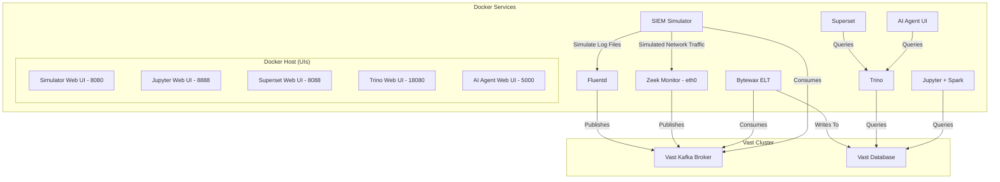

# SIEM Data Simulator Service Documentation

This document provides detailed documentation for the simplified Docker-based SIEM Data Simulator.

## Overview

This application provides a streamlined environment for generating SIEM events and network traffic using Zeek and Fluentd, open-source network tools. It leverages Docker and standard bridge networking to simplify deployment and management. The system includes a Zeek monitoring container and a SIEM simulation container to generate test traffic that get sent to Vast Kafka.

Apache Spark and Jupyter has been included and two spark streaming applications provided that perform live consumption of Kafka events that get saved to Vast Database.

Trino SQL query engine and Superset visualisation and exploration applications have also been included, along with an example Superset dashboard.

## Architecture

The application consists of two main Docker services connected via a standard Docker bridge network (`zeek-network`). Zeek monitors the traffic flowing between containers on this network and outputs logs to a Kafka broker.



-   **zeek-live**: The core Zeek monitoring container. It captures traffic on its `eth0` interface within the `zeek-network` (including traffic from the Traffic Simulator) and sends analyzed logs to the Kafka Broker.
-   **SIEM-simulator**: A Python-based container using Scapy and other tools to generate various types of network traffic and SIEM events. It includes a web interface for easy control.
-   **fluentd**: A log collection and forwarding service that reads log events from the traffic simulator and forwards them to Kafka in JSON format with structured parsing.
-   **jupyspark**: A Jupyter Notebook environment with Apache Spark pre-installed for data analysis and processing. Provides example notebooks for consuming Kafka events and writing to Vast Database.
-   **trino**: A distributed SQL query engine that provides the primary interface for analyzing data stored in the Vast Database. Includes a web UI for query execution and management.
-   **superset**: An Apache Superset web application for data visualization and dashboard creation, with pre-configured connections to Trino for exploring SIEM analytics data.

## Setup

To get the application up and running, follow these steps:

1.  **Prerequisites**: Ensure you have Docker and Docker Compose (v2.2+) installed.

2.  **Clone the repository**: If you haven't already, clone the repository containing the project files.
3.  Create a `.env` file in the project root directory and configure the environment variables.
4.  **Build and start the services**: Navigate to the project directory in your terminal and run:
    ```bash
    docker compose --profile all up --build -d
    ```
    The `-d` flag runs the services in detached mode.
    Docker Compose will automatically load the environment variables from the `.env` file.
5.  **Verify services are running**:
    ```bash
    docker compose --profile all ps
    ```
    You should see the docker services with `State` as `Up`.

> [!TIP]
> Docker profiles have been configured to allow you to selectively run services if required:
>  - `all`: run everything
>  - `simulator`: run the SIEM simulator, zeek-live-monitor and fluentd services
>  - `etl`: run the jupyspark service (notebooks need to be manually started)
>  - `dashboard`: run the trino and superset service


## Components

### `zeek-live` Service

The service is defined in `docker-compose.yml`. The environment variables are configured in the `.env` file located in the project root directory.

-   **Purpose**: Monitors network traffic within the `zeek-network`.
-   **Dockerfile**: `Dockerfile.zeek-live-monitor` - Builds the Zeek image, installs the Zeek-Kafka plugin, and copies the monitoring script.
-   **Configuration**:
    -   **Environment Variables**:
        -   `KAFKA_BROKER`: Kafka broker address. Used by the Zeek-Kafka plugin. This variable must be set for Zeek to connect to Kafka and is configured in the `.env` file.
        -   `KAFKA_ZEEK_TOPIC`: Kafka topic name for logs (default: `zeek-live-logs`). This variable is configured in the `.env` file.
        -   `MONITOR_INTERFACE`: Network interface for Zeek to monitor (default: `eth0`). This variable is configured in the `.env` file.
    -   **Volumes**:
        -   `./zeek-config:/config`: Mounts the local `zeek-config` directory containing Zeek scripts (like `kafka-live.zeek`) into the container's `/config` directory.
        -   `./zeek-logs:/logs`: Mounts the local `zeek-logs` directory to store Zeek's output logs persistently.
        -   `./scripts:/scripts`: Mounts the local `scripts` directory containing the `zeek-live-monitor.sh` script.
    -   **Networks**: Connected to the `zeek-network` bridge network.
    -   **Capabilities**: `NET_ADMIN`, `NET_RAW` - Required for packet capture.
    -   **Privileged**: `true` - Enables promiscuous mode for the network interface, necessary for capturing all traffic.
    -   **Command**: `/scripts/zeek-live-monitor.sh` - Executes the monitoring script on container startup.

### `siem-simulator` Service

-   **Purpose**: Generates various types of network traffic for testing Zeek's monitoring capabilities.
-   **Dockerfile**: `services/simulator/Dockerfile` - Builds a Python environment with Scapy and other network tools.
-   **Configuration**:
    -   **Volumes**: 
        -   `./services/simulator/src:/src/simulator`: Mounts the local simulator source directory containing the Python traffic generation scripts.
        -   `./services/fluentd/logs:/logs`: Mounts the fluentd logs directory for log file generation.
    -   **Ports**: `8080:8080` - Maps host port 8080 to container port 8080, exposing the web interface for the traffic generator.
    -   **Networks**: Connected to the `zeek-network` bridge network.
    -   **Capabilities**: `NET_ADMIN`, `NET_RAW` - Required for crafting and sending raw packets using Scapy.
    -   **Command**: `python3 /src/simulator/simulator_server.py` - Starts the web server for the events generator.
    -   **Profiles**: `simulator`, `all` - Service runs when these profiles are active.

### `zeek-network`

-   **Purpose**: A Docker bridge network connecting the two services. This is the network segment that Zeek monitors.
-   **Configuration**:
    -   **Driver**: `bridge` - Standard Docker bridge network.
    -   **IPAM**: Configured with a static subnet `192.168.100.0/24`.

### `fluentd` Service

-   **Purpose**: Collects logs from the traffic simulator and forwards them to Kafka.
-   **Dockerfile**: `Dockerfile.fluentd` - Installs the fluent-plugin-kafka plugin.
-   **Configuration**:
    -   Reads log events from `/logs/events.log`.
    -   Parses the logs using a regular expression to extract fields like `time`, `event`, `user`, `src_ip`, and `dst_ip`.
    -   Sends the parsed logs to a Kafka broker specified by the `KAFKA_BROKER` environment variable, using the topic specified by the `KAFKA_EVENT_LOG_TOPIC` environment variable.
    -   The output format is JSON.

### `jupyspark` Service

-   **Purpose**: Provides a Jupyter Notebook environment with Apache Spark pre-installed for data analysis and processing.
-   **Dockerfile**: `services/jupyspark/Dockerfile` - Builds a Docker image with Jupyter Notebook, Apache Spark, and necessary dependencies.
-   **Configuration**:
    -   **Environment Variables**:
        -   `JUPYTER_PASSWORD`: Sets the password for accessing the Jupyter Notebook. It is highly recommended to set this variable to protect your notebook. You can set this variable in the `.env` file.
    -   **Ports**: `8888:8888` - Maps host port 8888 to container port 8888, allowing access to the Jupyter Notebook from your web browser.
    -   **Volumes**:
        -   `./services/jupyspark/examples:/home/jovyan/work/examples`: Mounts the local `services/jupyspark/examples` directory to the `/home/jovyan/work/examples` directory in the container, making the example notebooks available in the Jupyter Notebook environment.
    -   **Profiles**: `etl`, `all` - Service runs when these profiles are active.

#### Accessing the Jupyter Notebook

1.  Ensure the `jupyspark` service is running by executing `docker compose up --build -d`.
2.  Open your web browser and navigate to `http://<your_server_ip>:8888`. Replace `<your_server_ip>` with the IP address of the server where the Docker container is running.
3.  When prompted, enter the password you set in the `JUPYTER_PASSWORD` environment variable.

###  `bytewax-fluentd-etl` Service

-   **Purpose**: Consumes Fluentd logs from Kafka, transforms them, and loads them into Vast.
-   **Source Code**: `services/bytewax-etl/src/fluentd_to_vastdb.py`
-   **Configuration**:
    -   Subscribes to the Kafka topic where Fluentd logs are published.
    -   Transforms the logs into a format suitable for Vast.
    -   Loads the transformed data into Vast.

### `bytewax-zeek-etl` Service

-   **Purpose**: Consumes Zeek logs from Kafka, transforms them, and loads them into Vast.
-   **Source Code**: `services/bytewax-etl/src/zeek_to_vastdb.py`
-   **Configuration**:
    -   Subscribes to the Kafka topic where Zeek logs are published.
    -   Transforms the logs into a format suitable for Vast.
    -   Loads the transformed data into Vast.

### `trino` Service

-   **Purpose**: Provides a distributed SQL query engine for analyzing data stored in the Vast Database. Acts as the primary query interface for the SIEM analytics platform.
-   **Image**: `vastdataorg/trino-vast:429` - Pre-built Trino image with Vast Database connector.
-   **Configuration**:
    -   **Dependencies**: Requires `trino_setup_config` service to complete successfully before starting.
    -   **Ports**: `18080:8080` - Maps host port 18080 to container port 8080, providing access to the Trino web UI and query interface.
    -   **Memory Limit**: `8g` - Allocated 8GB of memory for query processing.
    -   **Platform**: `linux/amd64` - Specifies the platform architecture.
    -   **Volumes**:
        -   `./services/trino/generated/vast.properties:/etc/trino/catalog/vast.properties:ro`: Mounts the generated Vast Database connection configuration (read-only).
        -   `./services/trino/config.properties:/etc/trino/config.properties:ro`: Mounts the Trino server configuration (read-only).
    -   **Health Check**: Configured to check service health via HTTP endpoint every 30 seconds with 10 retries.
    -   **Profiles**: `dashboard`, `all` - Service runs when these profiles are active.

### Superset Services

-   **Purpose**: Provides the main Apache Superset web application for data visualization and dashboard creation.
-   **Image**: `apachesuperset.docker.scarf.sh/apache/superset:4.0.2` - Official Apache Superset image.
-   **Configuration**:
    -   **Ports**: `8088:8088` - Maps host port 8088 to container port 8088, providing access to the Superset web interface.
    -   **Dependencies**: Requires `db` (PostgreSQL) and `redis` services to be running.
    -   **Command**: Custom command that installs Trino SQLAlchemy driver and starts the Superset application server.
    -   **User**: `root` - Runs with root privileges for installation of additional packages.
    -   **Volumes**: Shared volumes for Docker configuration and Superset home directory.
    -   **Profiles**: `dashboard`, `all` - Service runs when these profiles are active.

#### Uploading the dashboard

- Upload the [siem_dashboard.zip](./services/superset/siem_dashboard.zip) Dashboard to Superset
- Edit each Dataset
  - Click the padlock to begin editing
  - Change the Schema name field to match your schema.

## Zeek Configuration (`zeek-config/kafka-live.zeek`)

This Zeek script configures Zeek for live monitoring and sending logs to Kafka, along with loading various protocol analyzers and detection policies. The Kafka broker address *must* be specified using the `KAFKA_BROKER` environment variable. If this variable is not set, Zeek will exit with an error.

-   **Protocol Analyzers Loaded**: `conn`, `dns`, `http`, `ssl`, `ftp`, `ssh`, `smtp`. These enable Zeek to parse and log events for these specific protocols.
-   **Detection Frameworks/Policies Loaded**: Includes policies for notice generation, known hosts/services, external DNS names, FTP/HTTP/SSH detection (including SQL injection and brute-forcing), SSL certificate validation, JSON logs, traceroute detection, and software vulnerability/version changes.
-   **Kafka Plugin**: `@load Seiso/Kafka` loads the installed Kafka plugin.
-   **Logging Configuration**:
    -   `Log::enable_local_logging = T`: Enables writing logs to local files in addition to Kafka.
    -   `Log::default_rotation_interval = 1hr`: Rotates log files hourly.
    -   `Log::default_logdir = "/logs"`: Sets the output directory for local logs (mounted from `./zeek-logs`).
-   **Kafka Configuration (`Kafka::kafka_conf`)**:
    -   `metadata.broker.list`: Specifies the Kafka broker address.
    -   `client.id`: Client identifier for Kafka (default: `zeek-live-monitor`).
    -   `batch.num.messages = 1`, `queue.buffering.max.ms = 10`, `linger.ms = 0`: Settings optimized for low-latency delivery to Kafka, sending messages almost immediately.
    -   `acks = 1`: Requires acknowledgment from the Kafka leader broker.
    -   `retries = 3`, `delivery.timeout.ms = 5000`, `request.timeout.ms = 2000`, `socket.timeout.ms = 1000`: Retry and timeout settings for Kafka communication.
    -   `debug = "broker,topic,msg"`, `log_level = 7`: Enable verbose Kafka debugging logs within Zeek.
-   **Kafka Log Sending**: `Kafka::send_all_active_logs = T` sends all generated logs (connection, http, dns, etc.) to Kafka.
-   **Timestamp Format**: `Kafka::json_timestamps = JSON::TS_ISO8601` uses ISO8601 format for timestamps in JSON logs sent to Kafka.
-   **JSON Output**: `LogAscii::use_json = T` configures local logs to also use JSON format.
-   **Checksum Offloading Fix**: `ignore_checksums = T` is set to ignore invalid TCP checksums, which are common in containerized environments due to NIC offloading.
-   **Detection Thresholds**: `SSH::password_guesses_limit = 3` makes the SSH brute force detection more sensitive for demonstration purposes.
-   **Event Handlers**: Includes custom `zeek_init`, `connection_established`, `new_connection`, `dns_request`, `http_request`, `http_reply`, `notice`, `SSH::password_guesses_exceeded`, `new_packet`, `connection_state_remove`, and `weird` event handlers with `print` statements for basic console output within the Zeek container logs. The `dns_request` and `http_request` handlers include simple pattern matching for suspicious activity that triggers Zeek notices.

## SIEM Data Generation

Traffic within the `zeek-network` is automatically monitored by the `zeek-live` container. You can generate test traffic in several ways:

1.  **Web Interface (Traffic Simulator)**:
    -   Access the traffic simulator web interface at `http://localhost:8080`.
    -   This interface provides buttons to start various predefined scenarios (Web Browsing, File Transfer, Video Stream, Office Network, Security Test, Enhanced Attacks, Port Scan, SQL Injection) and a form for custom traffic generation (HTTP, DNS, Mixed).
    -   It also includes controls for a continuous simulation mode that runs random scenarios with configurable intervals and concurrency.
    -   A Kafka Consumer section allows viewing logs received from Zeek via Kafka directly in the browser.
    -   The web interface uses the `src/simulator/simulator_server.py` Flask application.

2.  **SIEM Simulator Scripts**:
    -   The `src/simulator/network_traffic_generator.py` and `src/simulator/enhanced_traffic_generator.py` Python scripts contain the logic for generating various types of traffic using Scapy and real socket connections.
    -   `network_traffic_generator.py` focuses on generating packets at the network layer (using `sendp` or `send`), simulating various scenarios like web browsing, file transfer, etc.
    -   `enhanced_traffic_generator.py` focuses on creating *real* network connections using Python's `socket` and `requests` libraries (if available). This is crucial for generating traffic that Zeek can fully analyze, such as complete HTTP requests or TCP handshakes. It includes functions for generating real HTTP, malicious HTTP, DNS, port scan, SSH brute force, and data exfiltration traffic, as well as a comprehensive attack simulation.
    -   These scripts are executed by the `traffic-simulator` container.

3.  **Container-to-Container Communication**:
    -   Any communication initiated directly between containers on the `zeek-network` (e.g., `docker exec traffic-simulator ping zeek-live-monitor`) will also be monitored by Zeek.

## Monitoring and Logging

Zeek captures and analyzes traffic on its `eth0` interface within the `zeek-network`. Logs are generated and outputted to Kafka, and also saved to local files.

Logs are available in two primary locations:

1.  **Kafka**:
    -   The Zeek-Kafka plugin sends all active logs to the configured Kafka broker and topic (`172.200.204.1:9092`, `zeek-live-logs`) by default.
    -   Logs sent to Kafka are in JSON format with ISO8601 timestamps and tagged.
    -   You can view these logs using a Kafka consumer or via the Kafka Consumer section in the traffic simulator web interface (`http://localhost:8080`).

2.  **Local Log Files**:
    -   Zeek writes logs to the `/logs` directory inside the container, which is mounted to the local `./zeek-logs` directory.
    -   Logs are in JSON format (`conn.log`, `http.log`, `dns.log`, etc.).
    -   You can view these logs directly on your host machine in the `./zeek-logs` directory.
    -   Example: `cat zeek-logs/conn.log`

3.  **Container Logs**:
    -   Basic event messages printed by the `zeek-live-monitor.sh` script and the custom Zeek event handlers in `kafka-live.zeek` are sent to the container's standard output.
    -   You can view these using `docker compose logs -f zeek-live`.

## Troubleshooting

### Common Issues

-   **Interface not found**: Zeek might fail to start if the specified `MONITOR_INTERFACE` (`eth0`) is not available.
    -   Check available interfaces inside the container: `docker exec zeek-live-monitor ip link show`
-   **No traffic captured**:
    -   Ensure containers are in the same `zeek-network`.
    -   Verify traffic is being generated (check traffic simulator logs).
    -   Confirm Zeek is monitoring the correct interface (`eth0`).
-   **Kafka connection issues**:
    -   Check the `KAFKA_BROKER` address in `docker-compose.yml` and `zeek-config/kafka-live.zeek`.
    -   Verify the Kafka broker is running and accessible from the Zeek container.
    -   Zeek is configured to retry Kafka connections and will continue monitoring even if Kafka is unreachable. Check the Zeek container logs for Kafka-related debug messages.

### Debug Commands

-   **Check network configuration**:
    ```bash
    docker network ls
    docker network inspect zeek-service_zeek-network
    ```
-   **Check container networking**:
    ```bash
    docker exec zeek-live-monitor ip addr show
    docker exec zeek-live-monitor ip route show
    ```
-   **Test connectivity between containers**:
    ```bash
    docker exec traffic-simulator ping zeek-live-monitor
    ```
-   **View Zeek container logs**:
    ```bash
    docker compose logs -f zeek-live
    ```
## Additional Resources

-   [Zeek Documentation](https://docs.zeek.org/)
-   [Fluentd Documentation](https://docs.fluentd.org/)
-   [Zeek-Kafka Plugin](https://github.com/SeisoLLC/zeek-kafka)
-   [Docker Networking](https://docs.docker.com/)
-   [Scapy Documentation](https://scapy.net/)
